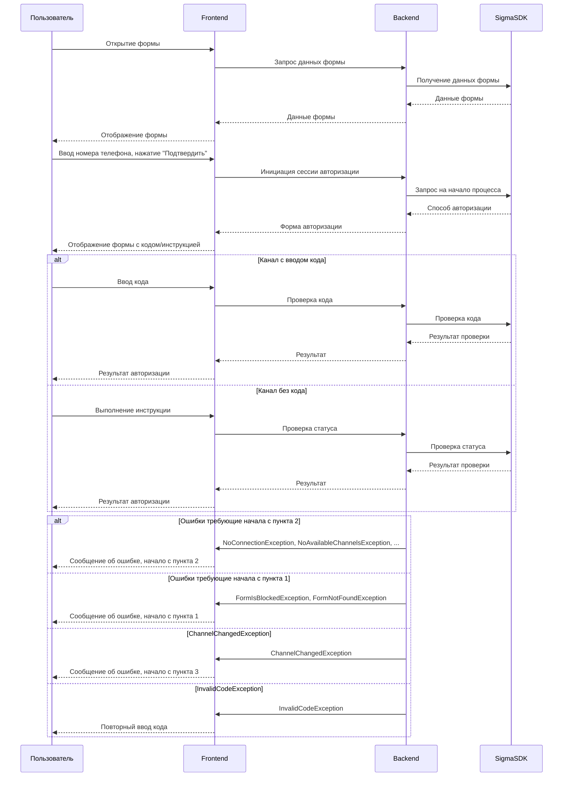

# SIGMA OTP NodeJS SDK

<p align="center">
  
</p>
<p align="center">
	<a href="https://www.npmjs.com/package/cloudipsp-node-js-sdk"></a>
	<a href="https://www.npmjs.com/package/cloudipsp-node-js-sdk"></a>
	<a href="https://www.npmjs.com/package/cloudipsp-node-js-sdk"></a>
</p>

## OTP service provider
SDK предоставляет удобный интерфейс к сервису авторизации SIGMA по разным каналам: SMS, Flashcall, голосовая авторизация, Viber, WhatsApp, авторизация по мобильному ID, Callback.
[Подробнее](https://sigmasms.ru/servis-avtorizatsij/)
SIGMA OTP SDK для NodeJS облегчает быструю интеграцию нашего готового контроллера с вашим фреймворком, предлагая мгновенное подключение. Помимо быстрой интеграции, SDK также предоставляет гибкие возможности для детальной настройки и подробной самостоятельной интеграции, адаптируясь к уникальным требованиям вашего проекта.

## Быстрая интеграция
Импортируйте SDK и используйте предоставленные контроллеры для nestjs, express, fastify, или Bun.js, чтобы мгновенно интегрировать авторизацию в ваше приложение.

Пример с Express:

```
import express from 'express';
import { registerExpressRoutes } from '@sigma-otp-sdk/controllers/express.controller';

const app = express();
app.use(express.json());

registerExpressRoutes(app, 'your_form_id');

app.listen(3000, () => {
    console.log(`Server running on port 3000`);
});

```
Остальные примеры смотрите в папке (Примеры)[./src]

## Принцип работы

1. **Загрузка данных формы**: пользователь обращается к frontend клиента, который в свою очередь обращается к backend клиента, а тот – к Sigma SDK для получения данных формы.

2. **Инициация сессии авторизации**: пользователь вводит номер телефона и нажимает кнопку "Подтвердить". Frontend отправляет запрос к backend, который обращается к Sigma SDK для инициации процесса авторизации.

3. **Отображение формы авторизации**: backend запрашивает у Sigma SDK способ авторизации и передает его frontend, который отображает пользователю соответствующую форму.

4. **Проверка статуса и завершение**: в зависимости от способа авторизации, пользователь вводит код или выполняет действие, указанное в инструкции. Frontend отправляет данные на backend, который связывается с Sigma SDK для проверки статуса и завершения сессии.

Обработка ошибок включается в процесс в зависимости от типа ошибки, возвращая процесс на соответствующий этап.



## Установка

1. Убедитесь, что у вас установлен Node.js 12+.
2. Установите SDK в проект с помощью npm: `npm install sigma-otp-sdk`

## Использование:

1. **Импорт SDK**:
   
   ```typescript
   import { SigmaOtpSDK } from '@sigma-otp-sdk'
   ```

2. **Инициализация и отправка кода подтверждения**:

   ```typescript
   const client = new SigmaOtpSDK({ formId })
   const { requestId } = await client.send(phone)
   ```

3. **Получение канала и подтверждение кода**:

   ```typescript
   const channel = await client.getChannel(requestId)
   if (channel.channelType === 'code') {
     // Подтверждение кодом
     await client.verifyCode(requestId, '1234')
   } else {
     // Подтверждение без кода
     // ...
   }
   ```

4. **Проверка статуса запроса и завершение**:

   ```typescript
   const status = await client.checkStatus(requestId)
   if (status.success) { 
     await client.complete(requestId)
   }
   ```

#### Обработка ошибок:

На любом шаге могут возникать ошибки, которые следует обработать.
Для всех этих ошибок нужно начать с пункта 2:
- NoConnectionException
- NoAvailableChannelsException
- CaptchaNotConfirmedException
- AttempsExpiredException
- SessionTimeoutException
- RateLimitException

Для всех этих ошибок нужно начать с пункта 1:
- FormIsBlockedException
- FormNotFoundException

При ошибке ChannelChangedException нужно начать с пункта 3\
При ошибке InvalidCodeException нужно дать пользователю возможность повторно ввести код.


В случае возникновения ошибок SDK вызовет подготовленное исключение с типом IError, содержщее тип ошибки и сообщение. Вы можете отобразить сообщение по умолчанию или собственное на основе титпа ошибки.

```typescript
try {
  // ваш код
} catch (e: unknown) {
  // Известные ошибки SDK, для которых потребуется перезапуск процесса авторизации
  if (e instanceof NoConnectionException
    || e instanceof NoAvailableChannelsException
    ...
  ) {
    console.log(`Ошибка: "${e.message}", попробуйте пройти авторизацию еще раз`)
  }
  ...
}

```
Больше кода найдете в Примерах

#### Простой пример использования:

Пример использования SDK представлен в коде ниже:

```typescript
import { SigmaOtpSDK, SigmaOtpSDKEnvironmentEnum } from '@sigma-otp-sdk'

async function main() {
  const client = new SigmaOtpSDK({ 
    formId: 'Ваш id формы',
    environment: SigmaOtpSDKEnvironmentEnum.test
  })
  try {
    const { requestId } = await client.send(phone)
    const channel = await client.getChannel(requestId)
    if (channel.channelType === 'code') {
      // Подтверждение кодом
      await client.verifyCode(requestId, '1234')
    } else {
      // Ожидание подтверждения без кода
    }
    // Проверка статуса
    const status = await client.checkStatus(requestId)
    if (status.success) { 
      await client.complete(requestId)
    }
  } catch (error) {
    console.error('Произошла ошибка:', error)
  }
}

main()
```

#### Дополнительно:
- [Регистрация контроллера для frontend ](src/sdk/controllers/README.md)
- Подписка на события
- [Все примеры](src/sdk/examples)
- [Схема взаимодействия](#cхема-взаимодействия)

#### Подписка на события:
Вы можете подписаться на события для запроса и sdk автоматически вызовет ваш коллбек при возниковении события. Примеры использования:
```
  const client = new SigmaOtpSDK({ formId })
  const { requestId } = await client.send(phone)

  client.onChannelChanged(requestId, (payload: GetChannelResponseDto) => {
    console.log("Channel changed", requestId,payload)
  }) 

   client.onSuccessConfirmation(requestId, handler: (payload: ISuccessPayload) => {
    console.log("Channel changed", requestId,payload)
  }) 
 
   client.onError(requestId, handler: (payload: IErrorPayload) => {
    console.log("Error happend", requestId,payload)
  })

```
