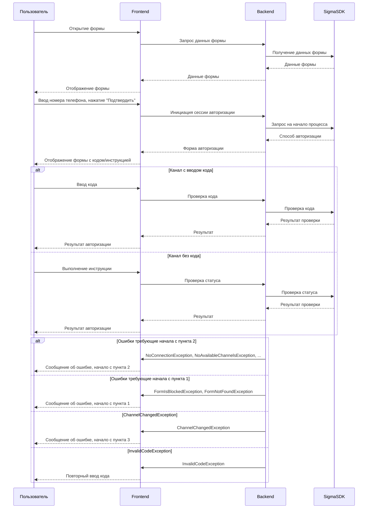

Схема взаимодействия в формате memraid

```mermaid
sequenceDiagram
    participant Пользователь
    participant Frontend
    participant Backend
    participant SigmaSDK

    Пользователь->>Frontend: Открытие формы
    Frontend->>Backend: Запрос данных формы
    Backend->>SigmaSDK: Получение данных формы
    SigmaSDK-->>Backend: Данные формы
    Backend-->>Frontend: Данные формы
    Frontend-->>Пользователь: Отображение формы
    
    Пользователь->>Frontend: Ввод номера телефона, нажатие "Подтвердить"
    Frontend->>Backend: Инициация сессии авторизации
    Backend->>SigmaSDK: Запрос на начало процесса
    SigmaSDK-->>Backend: Способ авторизации
    Backend-->>Frontend: Форма авторизации
    Frontend-->>Пользователь: Отображение формы с кодом/инструкцией

    alt Канал с вводом кода
        Пользователь->>Frontend: Ввод кода
        Frontend->>Backend: Проверка кода
        Backend->>SigmaSDK: Проверка кода
        SigmaSDK-->>Backend: Результат проверки
        Backend-->>Frontend: Результат
        Frontend-->>Пользователь: Результат авторизации
    else Канал без кода
        Пользователь->>Frontend: Выполнение инструкции
        Frontend->>Backend: Проверка статуса
        Backend->>SigmaSDK: Проверка статуса
        SigmaSDK-->>Backend: Результат проверки
        Backend-->>Frontend: Результат
        Frontend-->>Пользователь: Результат авторизации
    end

    alt Ошибки требующие начала с пункта 2
        Backend->>Frontend: NoConnectionException, NoAvailableChannelsException, ...
        Frontend-->>Пользователь: Сообщение об ошибке, начало с пункта 2
    else Ошибки требующие начала с пункта 1
        Backend->>Frontend: FormIsBlockedException, FormNotFoundException
        Frontend-->>Пользователь: Сообщение об ошибке, начало с пункта 1
    else ChannelChangedException
        Backend->>Frontend: ChannelChangedException
        Frontend-->>Пользователь: Сообщение об ошибке, начало с пункта 3
    else InvalidCodeException
        Backend->>Frontend: InvalidCodeException
        Frontend-->>Пользователь: Повторный ввод кода
    end
```

